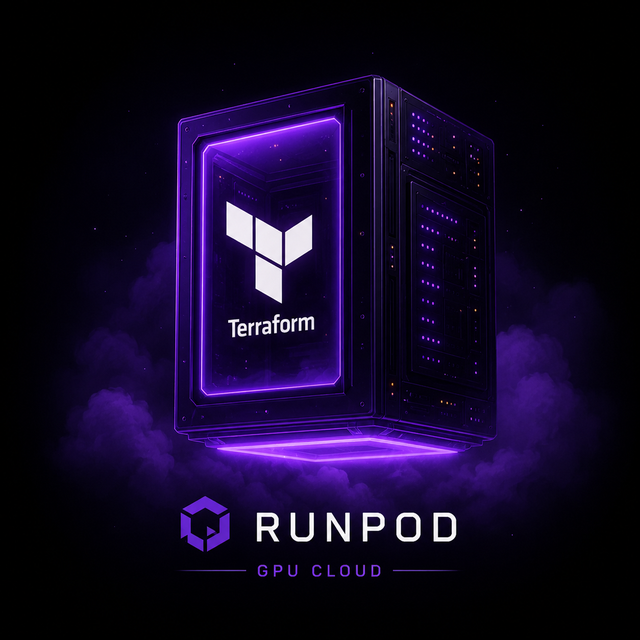

<div align="center">



# terraform-runpod-vllm

**Provisionnez un GPU RunPod et servez un LLM en vLLM (API compatible OpenAI) — en un `terraform apply`, sans brûler votre budget.**

[](https://www.terraform.io/)
[](https://github.com/vllm-project/vllm)
[](https://runpod.io)
[](#tests)
[](LICENSE)

</div>

---

## Pourquoi ce projet

Louer un GPU pour servir un LLM devrait être trivial. En pratique, l'API RunPod
a un **piège qui coûte de l'argent** : `POST /v1/pods` renvoie parfois `HTTP 500`
**tout en créant quand même le pod**. Un retry naïf sur le 500 crée des pods
**dupliqués facturés** (retour d'expérience : 7 pods = ~17 $/h avant de s'en
rendre compte).

Ce module encapsule le contournement dans du Terraform propre :

- **Anti-duplication** — jamais confiance au code retour du POST ; vérification systématique via `GET /v1/pods`. Idempotent par nom de pod.
- **Budget guard** — si le pod créé dépasse `max_cost_per_hr`, il est **supprimé** et le déploiement échoue. Pas de mauvaise surprise si RunPod bascule sur un H100 hors stock.
- **Teardown propre** — `terraform destroy` supprime le pod pour arrêter la facturation ; la clé API passe par une variable d'environnement, jamais en ligne de commande.

Le provider Terraform natif `runpod/runpod` (136 downloads, aucune doc de
ressource, aucune protection false-500) n'est pas fiable pour du GPU facturé —
d'où ce wrapper REST testé.

## Architecture

```text
terraform apply
     │
     ▼
data "external" ──> scripts/runpod_create.py   (safe-create loop, budget guard)
     │                    │
     │                    ▼
     │              RunPod REST API  ──>  pod GPU + vllm/vllm-openai
     ▼
outputs: endpoint = https://<pod>-8000.proxy.runpod.net  (API OpenAI-compatible)
```

## Prérequis

- [Terraform](https://terraform.io) ≥ 1.5, Python 3
- Un compte RunPod avec crédit + une clé API REST
- (optionnel) HashiCorp Vault pour stocker la clé

## Démarrage

```bash
# 1. Clé API depuis Vault (recommandé — jamais de secret en clair)
eval $(make key)          # export TF_VAR_runpod_api_key=...
# ou : export TF_VAR_runpod_api_key="rp_xxx"

# 2. Config
cp terraform.tfvars.example terraform.tfvars   # ajuster model / GPU / budget

# 3. Déployer (idempotent, false-500 guarded, budget capé)
make init
make apply

# 4. Attendre que vLLM serve réellement (5-15 min : download + load)
make ready

# 5. Tester le modèle
make chat

# 6. Arrêter la facturation
make destroy
```

## Choix du modèle (important)

Par défaut : **Llama-3.1-8B-Instruct** (arch `llama`, supportée par le vLLM
stable, pas de `<think>`, déploie du premier coup). Évitez les archs bleeding-edge
(`qwen3_5_moe`, etc.) sur l'image `:latest` — elles crashent silencieusement au
chargement. Pour ces cas, passez `vllm_image = "vllm/vllm-openai:nightly"`.

Ne dépassez jamais `max_model_len` au-delà du `max_position_embeddings` natif du
modèle (vLLM refuse de démarrer).

## Variables

| Variable | Défaut | Rôle |
|----------|--------|------|
| `runpod_api_key` | — | Clé REST (via `TF_VAR_`, sensible) |
| `model` | `Meta-Llama-3.1-8B-Instruct` | Repo HF à servir |
| `gpu_type_ids` | `[A40, RTX A6000, A100 80GB]` | Liste de fallback, 1er dispo |
| `container_disk_gb` | `120` | Disque conteneur (> taille modèle) |
| `max_model_len` | `16384` | Contexte vLLM |
| `vllm_image` | `vllm/vllm-openai:latest` | `:nightly` pour archs récentes |
| `max_cost_per_hr` | `0.80` | Plafond budget ($/h) au-delà duquel le pod est supprimé |

## Outputs

| Output | Description |
|--------|-------------|
| `endpoint` | Base URL OpenAI-compatible (`/v1/models`, `/v1/chat/completions`) |
| `pod_id` | ID du pod RunPod |
| `cost_per_hr` | Coût réel facturé |
| `status` | Statut du pod (`RUNNING` ≠ vLLM prêt) |

## Tests

```bash
make test    # 3 scénarios money-critical, sans réseau
```

Couvre : **idempotence** (pas de doublon si le pod existe), **false-500**
(un seul POST malgré le HTTP 500), **budget guard** (pod supprimé si trop cher).

## Sécurité

- La clé API n'est jamais commitée ni passée en ligne de commande (env var uniquement).
- `terraform.tfvars` et `*.tfstate` sont gitignored (le state peut contenir des secrets).
- Rappel : un pod facture à l'heure même inactif — `make destroy` après usage.

## Licence

MIT.
